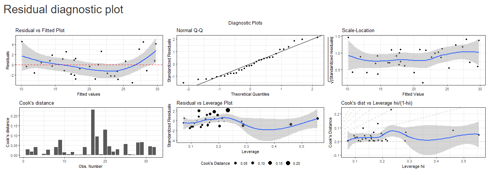

# A shiny app for exploring regression relations on mtcars data

## Introduction

This app creates custom regression model for **mtcars** dataset.

The user can choose one of the following workflows.

1.  The user can choose the **Select best model** option. In that case,
    the user may choose the number of variables to be selected for the
    model. The code will use adjusted R squared value to choose the best
    model restricted by the number of variables.

2.  The user can create the model by choosing the variables to be used.
    The best model will be chosen from the set of all possible models
    that these variables can generate.

The options to choose the variables are given in the left panel. The
residual statistics are also generated.

## Packages used

1.  shiny
2.  shinyjs
3.  leaps
4.  dplyr
5.  ggplot2
6.  gridExtra
7.  grid

## Residual diagnostics

A sample of residual statistics is given below. The diagnostic plot
includes

1.  Residual vs Fitted Plot
2.  Normal Q-Q plot
3.  Scale-Location plot
4.  Cook’s distance
5.  Residual vs Leverage Plot
6.  Cook’s distance vs Leverage
    *h**i**i*/(1−*h**i**i*)

## Reference

1.  [Playing with ggplot2](https://rpubs.com/therimalaya/43190) by Raju
    Rimal
2.  Weisberg, S., 2005. [Applied linear
    regression](http://www.ru.ac.bd/wp-content/uploads/sites/25/2019/03/304_03_Weisberg-Applied-Linear-Regression-Wiley-2013.pdf)
    (Vol. 528). John Wiley & Sons.
3.  [Shiny](https://cran.r-project.org/web/packages/shiny/index.html)
4.  [leaps: Regression Subset
    Selection](https://cran.r-project.org/web/packages/leaps/leaps.pdf)
